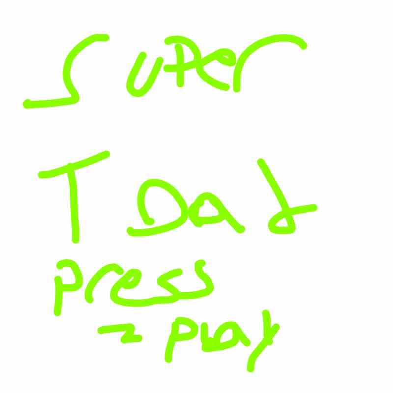
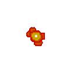
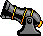

# TODO:

# Toadal Chaos

**Toadal Chaos** is our final processing Java Course! 
In this course students will master the foundations of Java, while learning new concepts preparing them for Unity and more complex projects. 

Toadal Chaos focuses on teaching good code structure while giving the students opportunities to demonstrate their understanding.
Furthermore, Toadal Chaos teaches more advanced object-oriented concepts such as Abstraction, Interfaces and Composition, while re-iterating over concepts taught in prior courses.

Any student who succeeds in Toadal Chaos will thrive in high school coding.

# Learning Goals

Learning goals should be understood by students at the end of the classes

## General Code Skill
* Variables
* Images
* Functions
* Animations
* List vs Arrays 
* For Loops (forward and reverse)
* Creating new objects
* Code separation (Increase readability with strategic files)
* Factory Design Pattern 

## Objected Oriented Programming
* Inheritance
* Abstraction
* Composition
* Encapsulation (This is glossed over, but exists in the project)
* Interfaces
* Dot notation

## Math
* Vector (From A to B)
* Distance between points (Pythagorean theorem)
* Normalization
* AABB Collision (Box collision)
* Matrices (Concept only, shortcuts used)

# Course Outline
This course is broken down into 10 lessons. Each lesson should be completed in the span of one class, however, depending on student pacing,
a lesson can be two weeks long. Students who finish early can customize the game however they’d like with the instructor's help, 
for instance, want to make the frog rainbow or add new characters?

| Week | Topic                                      | Suggested Homework                                   |
|------|--------------------------------------------|------------------------------------------------------|
| 1    | Movement                                   |                                                      |
| 2    | GameObjects                                | Think about what could be cool to add                |
| 3    | Inheritance and Abstraction                |                                                      |
| 4    | Animations and Composition                 | Try adding remaining animations                      |
| 5    | Animation and Moving Screen                |                                                      |
| 6    | Firing Projectiles controlled by animation | Practice making loops with different pattern puzzles |
| 7    | Interfaces                                 | Creating a custom particle                           |
| 8    | Factory Upgrades                           | Add more upgrades and make them functional           |
| 9    | End Game                                   | Try making upgrades destroy when hit                 |
| 10   | [Flexible] Wasps (Student Led)             |                                                      |

# Instructional Method
Students participate in Live Virtual Sessions through a video program called Zoom.
These sessions are the primary form of learning, where an instructor guides the student
through the course material. Our class sizes are limited to a maximum of 4 students per
instructor and take place between 1-2 hours once per week at a scheduled time and
Day.

Students also have access to our online resources through RP4K’s Canvas Portal.
Extra material in the form of quizzes, discussions, assignments, and other materials are
provided for additional learning outside of the Live Virtual Sessions. Previous course
recordings are uploaded and students can participate in class discussions or contact the
instructor with any questions they may have.

# Additional Notes:
**Installation needs to happen before the course starts.**
Please ensure that the student has the template installed and to keep GitHub desktop installed in case students would like to work in groups. Follow the installation guide below to get started and reach out if you have any questions at [our email info@realprogramming.com](mailto:info@realprogramming.com)!

# Links

[Play the Game]()

[Download if Link isn't working](https://drive.google.com/file/d/1ku3LWTmviG4ft8kdRMSf2sQD9CFurjIQ/view?usp=drive_link)

[Installation and Setup guide](https://docs.google.com/document/d/1l68CybTafnAKsQsMTc5M8fqCZZZ0au7lIT8ssTyRpw0/edit?usp=sharing)

[Website](https://realprogramming.com/)